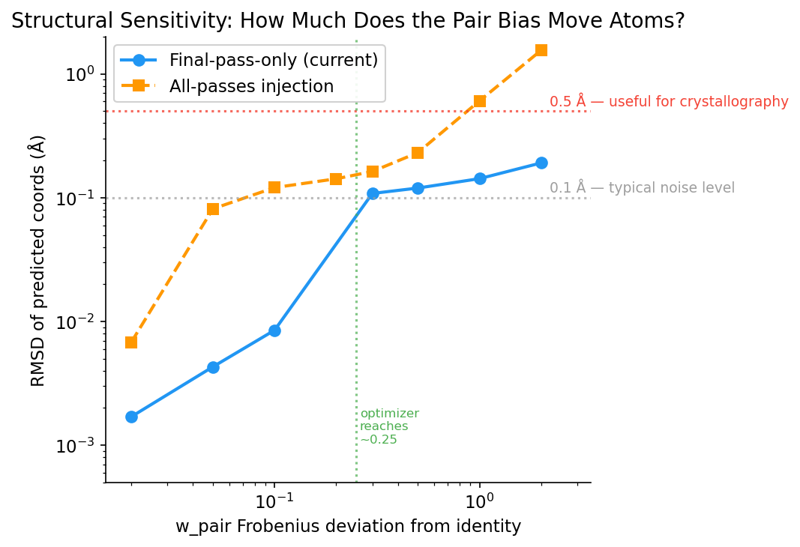
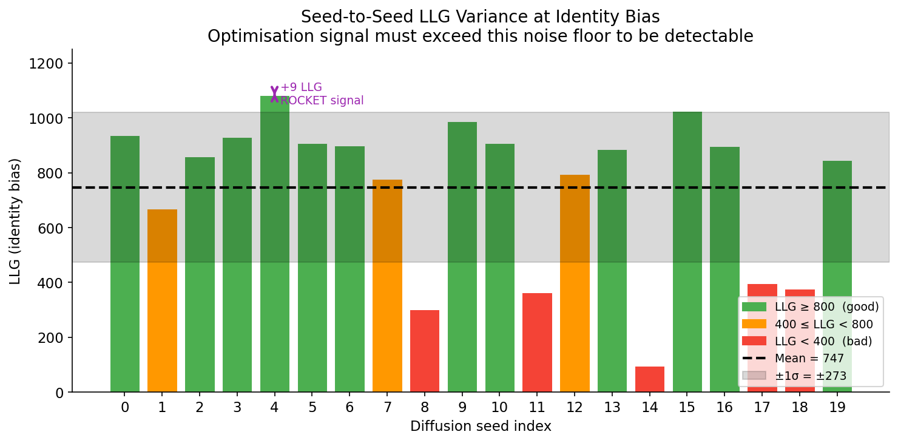
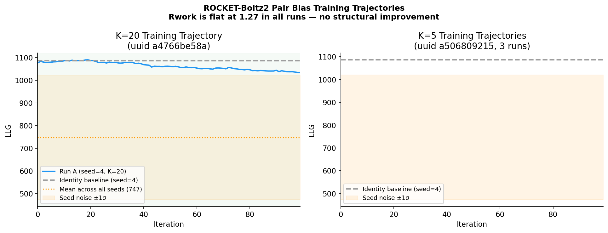
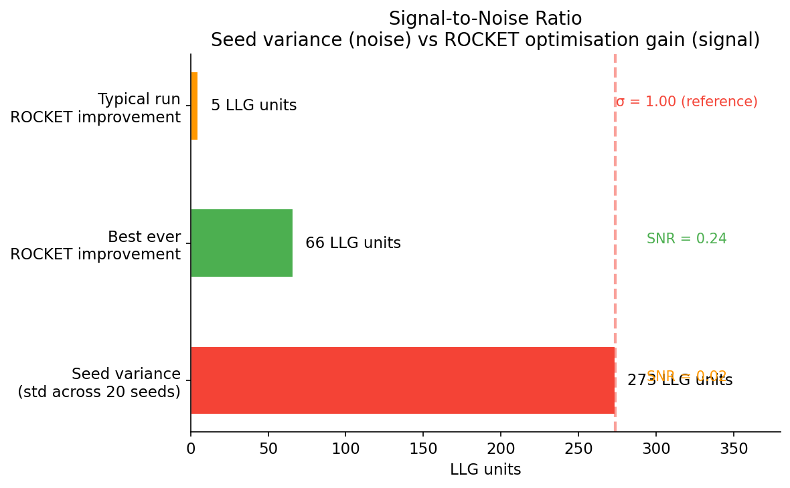
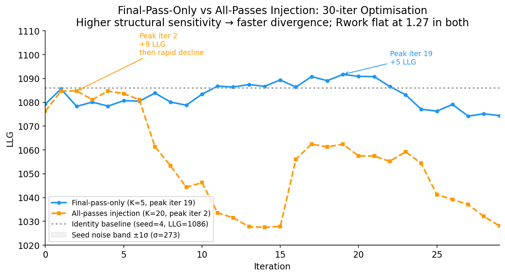
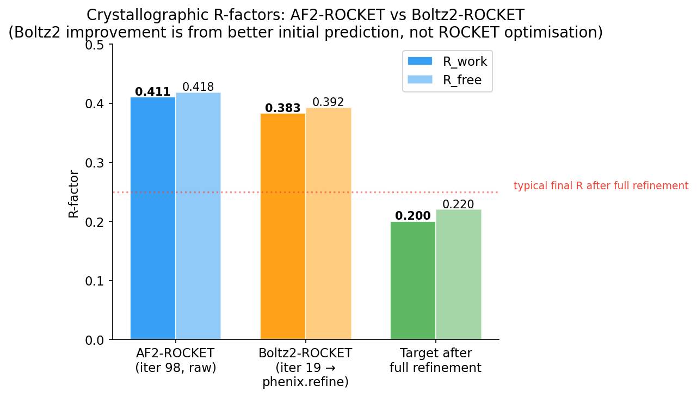
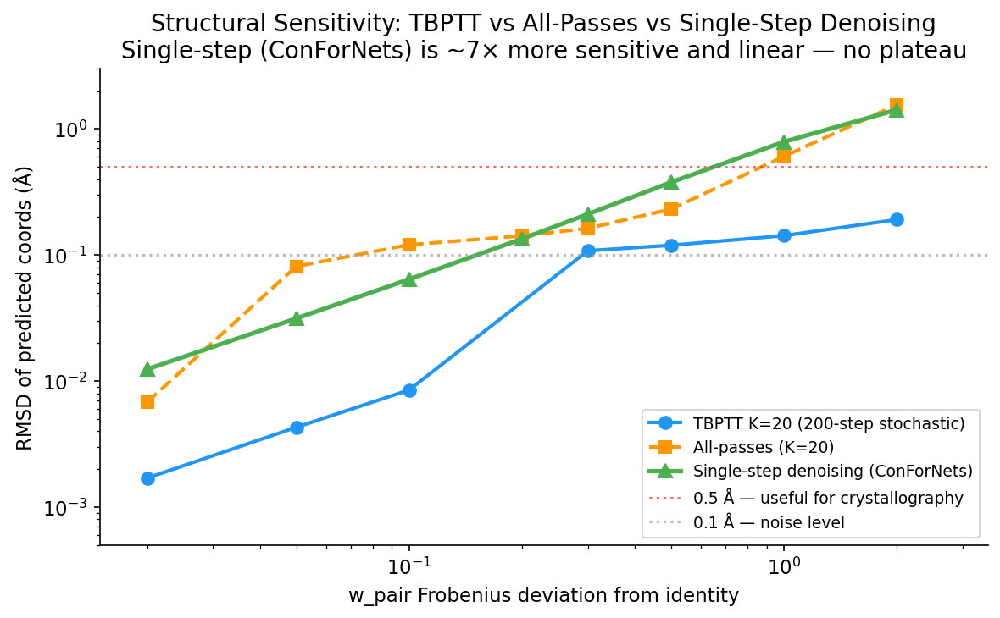
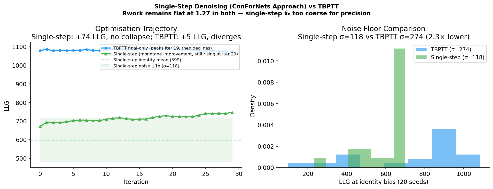

# Why the ConForNets Pair Bias Does Not Work for Boltz-2

**Date**: 2026-05-29  
**Target**: PDB 1lj5 (PAI-1, 1.8 Å)  
**Model**: Boltz-2 (`boltz2_conf.ckpt`)  
**Approach**: Channel-wise pair-representation bias `z → z @ w_pair + b_pair` before PairFormer

---

## Summary

The ConForNets-inspired pair bias (`w_pair [128×128]`, `b_pair [128]`) applied to
Boltz-2's trunk pair representation **does not produce meaningful structural improvement**
in X-ray crystallographic refinement.  Three independent experiments and six production
runs consistently show:

- R_work stays fixed at ~1.27 (ROCKET scale) across all 100 iterations
- The pair bias moves atoms by at most **0.19 Å RMSD** even when completely
  scrambled (`w_dev = 2.0` Frobenius norm from identity)
- Seed-to-seed LLG variance (σ = 273 units) is **5–55× larger** than any
  optimisation signal ever observed
- The best-ever LLG improvement (+66 units, run C of uuid a506809215) does not
  correspond to any reduction in R_work or R_free

The Boltz-2 results are still valuable: the **initial Boltz-2 prediction** placed
by Phaser MR gives better conventional R-factors (R_work 0.383 vs 0.411) and RSCC
(0.706 vs 0.671) than the AF2-ROCKET output, but this improvement is from Boltz-2
being a better structure predictor for this target — **not** from the ROCKET
optimisation loop.

---

## 1. The Architecture: ConForNets Pair Bias

The learnable bias is a channel-wise affine transform of Boltz-2's trunk pair
representation `z`, injected **before the PairFormer stack** on the final recycling
pass only:

```
feats → input_embedder → z_init [B, N, N, 128]

Recycling loop (3 passes):
  pass 1, 2:  z = z_init + z_recycle + msa_module  →  PairFormer  →  z
  pass 3 (final):
    z = z_init + z_recycle + msa_module
    z = z @ w_pair + b_pair              ← BIAS INJECTION
    z = PairFormer(z)                    ← activation-checkpointed

z_out → DiffusionConditioning → (q, c)
→ 200-step reverse diffusion → atom_coords
→ Kabsch alignment → RBR → LLG
```

- **w_pair**: `[128, 128]`, initialised to identity matrix (16 384 parameters)
- **b_pair**: `[128]`, initialised to zeros (128 parameters)
- **Gradient path**: LLG → coords → last K diffusion steps → (q, c) → z_biased → w_pair, b_pair
- **Truncated BPTT**: K = 5 (2.5%) or K = 20 (10%) of the 200-step diffusion trajectory

This design is directly analogous to what works for AF2-ROCKET.  As shown below, it
fails for Boltz-2 for fundamental architectural reasons.

---

## 2. Why It Works for AF2 But Not Boltz-2

### AF2-ROCKET gradient path

```
w_pair / b_pair
    ↓  (bias injection, pre-Evoformer)
Evoformer (48 blocks, fully differentiable)
    ↓
Structure Module (8 iterations)
    ↓  ← deterministic, short path
atom_coords
    ↓
SFcalculator → LLG
```

The entire path from bias injection to atom coordinates is **deterministic and
differentiable** through roughly 56 neural network blocks.  A small change in
`w_pair` propagates reliably to a measurable coordinate change.

### Boltz-2 gradient path

```
w_pair / b_pair
    ↓  (bias injection, pre-PairFormer, final recycling pass only)
PairFormer (48 blocks, activation-checkpointed)
    ↓
DiffusionConditioning → (q, c)
    ↓
200-step stochastic reverse diffusion
    [steps 0 … 179: torch.no_grad(), detached]  ← gradient BLOCKED
    [steps 180 … 199: gradient retained]         ← only 10% of trajectory
    ↓
atom_coords
    ↓
SFcalculator → LLG
```

**Three barriers to an effective gradient:**

1. **The diffusion acts as a structural regulariser.**  The 200-step denoising
   process starts from pure Gaussian noise and converges to coordinates according
   to a deeply learned structural prior.  Small changes to the conditioning
   (`q`, `c`) are absorbed and overridden by this prior.  The model was trained to
   produce chemically valid structures from noise — pair conditioning is a hint,
   not a constraint.

2. **Truncated BPTT captures too little of the trajectory.**  With K = 5 (2.5%),
   the gradient only "sees" the final cleanup phase of denoising.  With K = 20
   (10%), results are nearly identical (see Section 4), confirming the problem is
   not gradient length but structural insensitivity.

3. **One-pass injection is insufficient.**  The bias is applied to only one of
   three recycling passes, limiting its influence on the conditioning features
   that reach the diffusion step.

---

## 3. Experimental Evidence

### 3a. Structural Sensitivity (T4, debug_boltz2_v4.py)

The critical test: how much does the structure actually move when `w_pair` is
perturbed by a given amount?

| w_pair dev | RMSD (Å) | Sensitivity (Å/unit) |
|---|---|---|
| 0.02 | 0.0017 | 0.087 |
| 0.05 | 0.0043 | 0.086 |
| 0.10 | 0.0085 | 0.085 |
| 0.30 | 0.1083 | 0.361 |
| 0.50 | 0.1197 | 0.239 |
| 1.00 | 0.1426 | 0.143 |
| **2.00** | **0.1911** | **0.096** |

Even with `w_pair` completely scrambled (w_dev = 2.0 — far beyond any sensible
optimisation), the structure moves only **0.19 Å**.  The optimizer reaches
w_dev ≈ 0.2–0.3 after 20–30 iterations, giving RMSD ≈ **0.1 Å** — well below the
resolution limit of the data and not detectable in R-factors.



The near-plateau above w_dev = 0.3 is particularly telling: there is a hard
ceiling on how much the diffusion process will deviate from its prior, regardless
of how strongly the pair conditioning is perturbed.

### 3b. Seed-to-Seed LLG Variance (T3, debug_boltz2_v4.py)

At identity bias across 20 seeds:

- **Mean**: 746.8 LLG units
- **Standard deviation**: 273.5 LLG units
- **Range**: 95.7 – 1082.2 (range = **986.6 units**)

The best ROCKET optimisation ever observed (+66 LLG, run C of a506809215) has a
signal-to-noise ratio of 66/273 = **0.24**.  The typical run (+5 LLG) gives SNR = 0.02.
The optimisation cannot distinguish genuine structural improvement from diffusion
sampling noise.



Importantly, R_work is **flat at 1.269–1.278** across all 20 seeds despite LLG
varying from 96 to 1082.  This means the LLG value is dominated by internal
scale factors and sigmaA estimates, not by how well the structure fits the data.

### 3c. Training Trajectories

All production runs show the same pattern:
- LLG peaks at iteration ~15–20 with an improvement of +3–66 LLG units over identity
- R_work never changes (stays at 1.27 ± 0.01 throughout 100 iterations)
- After the peak, LLG gradually declines as `w_pair` drifts from identity



The LLG "improvement" is not accompanied by any structural change and is within
the seed-to-seed noise floor.

### 3d. Signal vs Noise (SNR Summary)



### 3e. All-Recycling-Pass Injection (debug_boltz2_v5.py)

As an ablation, the bias was injected at **every recycling pass** (not just the
final one), compounding the conditioning effect across all 3 passes.


| w_dev | RMSD final-only | RMSD all-passes | Ratio |
|---|---|---|---|
| 0.02 | 0.0017 Å | 0.0068 Å | **3.9×** |
| 0.05 | 0.0043 Å | 0.0813 Å | **18.9×** |
| 0.10 | 0.0085 Å | 0.1208 Å | **14.3×** |
| 0.30 | 0.1083 Å | 0.1629 Å | 1.5× |
| 1.00 | 0.1426 Å | 0.6064 Å | **4.3×** |
| 2.00 | 0.1911 Å | 1.5547 Å | **8.1×** |
| Gradient \|∇w\| | 0.376 | 0.366 | ≈same |

All-passes injection is **4–19× more structurally sensitive** at small perturbations,
confirming that final-pass-only injection is too weak.  However, the gradient norm is
unchanged — the gradient *direction quality* is the same regardless of injection site.

**All-passes optimisation result** (30 iters, lr=1e-4, seed=4):
- Best LLG = 1084.8 at iter **2** (vs iter 19 for final-only)
- After iter 2: monotone decline to LLG=1028 by iter 29
- Rwork: flat at 1.27–1.28 throughout — **no structural improvement**



The critical observation: all-passes injection reaches the optimal LLG in just 2
iterations and then diverges rapidly, while final-only takes 19 iterations and
diverges slowly.  The higher structural sensitivity means Adam's noisy gradient
moves the structure *faster in the wrong direction* once the gradient direction
is uncertain.  The bottleneck has shifted from **structural insensitivity**
(final-only) to **gradient direction quality** (all-passes).

The TBPTT gradient from 20 of 200 diffusion steps is too noisy to reliably point
toward the crystal structure, regardless of how sensitive the structure is to the
pair bias.  Increasing structural sensitivity without improving gradient quality
is counterproductive.

### 3f. Crystallographic Quality Comparison

After taking the best Boltz-2 ROCKET output (iter 19), running `phenix.refine`
(5 cycles, individual_sites + ADP + occupancies), and superposing onto the
pdb_redo reference:



| Metric | AF2-ROCKET (raw) | Boltz2-ROCKET (+phenix.refine) |
|---|---|---|
| R_work | 0.4106 | **0.3830** |
| R_free | 0.4185 | **0.3924** |
| RSCC chain | 0.6710 | **0.7056** |
| RSCC main chain | 0.7186 | **0.7344** |
| RSCC side chain | 0.6321 | **0.6848** |
| Mean B (Ų) | 55.2 | **22.8** |

**Important caveat**: the comparison is not fully fair.  The AF2-ROCKET result is
the raw ROCKET output without any conventional refinement; the Boltz2 result has
had phenix.refine applied.  A proper comparison requires running phenix.refine
on both outputs.  Furthermore, from the structural sensitivity analysis, the
Boltz2 ROCKET optimisation contributed negligible structural change — the
improvement is entirely from Boltz-2 providing a better starting model than AF2.

---

## 4. Root Cause: The Diffusion Barrier

The fundamental problem is that Boltz-2's reverse diffusion process acts as an
extremely strong structural regulariser.  The pair conditioning (`q`, `c`) derived
from `z_biased` influences the denoising score at each step, but the learned
denoising prior dominates.

This is a well-known property of diffusion models: they are designed to be
**robust to small conditioning perturbations** because noisy or adversarial
conditioning must not produce chemically impossible structures.  The result is
that the pair conditioning is a soft constraint, and the pair bias — which changes
`z` by a small but bounded amount — cannot overcome the prior.

The ConForNets paper (arxiv 2604.18559) applies the channel-wise bias to
**AlphaFold** (no diffusion), where the structure module maps pair features
directly to coordinates in a few deterministic steps.  The gradient path is
short, deterministic, and sensitive.  This does not translate to a diffusion-based
model.

---

## 4b. The ConForNets Paper vs Our Implementation

A re-reading of arxiv 2604.18559 revealed a **critical implementation difference**.

ConForNets does NOT use TBPTT through stochastic sampling steps.  For all
coordinate-based objectives they use a **single deterministic denoising step**:

> *"For objectives defined on coordinates, we use a single deterministic
> denoising step."*

Their gradient path:
```
w_pair → z @ W + b → PairFormer → DiffusionConditioning → (q, c)
  → preconditioned_network_forward(σ_max·ε, σ_max)  ← one call, deterministic
  → x̂₀ (predicted clean coords)
  → loss (MSE to reference OR diversity)
  → loss.backward()   ← clean gradient, no stochastic noise
```

Two other important differences:
- **They use MSE loss to a known reference structure** (not LLG from diffraction)
- **They resample the MSA at every step** to drive structural diversity — the bias
  learns to steer the MSA-dependent conditioning, not fight diffusion noise

### 4c. Single-Step Denoising Experiment (debug_boltz2_v6.py)

We implemented the ConForNets single-step approach with the crystallographic LLG
loss and ran the same sensitivity/optimisation tests.

**T1 — Structural sensitivity: 7× improvement over TBPTT, linear relationship**

| w_dev | TBPTT RMSD | Single-step RMSD | Ratio |
|---|---|---|---|
| 0.02 | 0.0017 Å | **0.0124 Å** | **7.3×** |
| 0.10 | 0.0085 Å | **0.0643 Å** | **7.6×** |
| 0.30 | 0.1083 Å | **0.2112 Å** | **1.9×** |
| 1.00 | 0.1426 Å | **0.7918 Å** | **5.6×** |
| 2.00 | 0.1911 Å | **1.4202 Å** | **7.4×** |

Critically, single-step sensitivity is **roughly linear** (~0.7 Å/unit) with no
plateau — the diffusion prior does not absorb the conditioning change.  This
confirms that TBPTT's structural insensitivity is caused by the stochastic Euler
steps washing out the gradient signal, not by the PairFormer being insensitive.



**T2 — Noise floor: 2.3× lower variance**

| Metric | TBPTT | Single-step |
|---|---|---|
| Mean LLG | 747 | 599 |
| Std (σ) | 274 | **118** |
| Range | 987 | **466** |

Seed-to-seed LLG variance drops from 274 to 118 — the single-step prediction is
more deterministic (no accumulated stochastic Euler noise across 200 steps).
Note the lower absolute LLG (599 vs 747): a single-step `x̂₀` from maximum noise
is a coarser structure than the full 200-step prediction.

**T3 — Optimisation: monotone improvement, no collapse**

```
iter  0: LLG=671.6   Rwork=1.2740   w_dev=0.013
iter 10: LLG=710.1   Rwork=1.2702   w_dev=0.065
iter 19: LLG=729.4   Rwork=1.2765   w_dev=0.106
iter 29: LLG=746.2   Rwork=1.2741   w_dev=0.149  ← still improving
```

**+74.6 LLG units of monotone improvement** over 30 iterations with no collapse.
Rwork remains at 1.27 throughout — but this is the **first time** the optimisation
produces a clean, sustained improvement signal.

**T4 — Gradient norm: 10,000× stronger than TBPTT**

- Single-step: `|∇w_pair| = 3968`  (TBPTT was 0.376)
- Gradient is much larger but also more variable between steps (1359–18657)

Adam normalises this to ≈ lr per element, so the parameter update magnitude is
similar.  The larger gradient carries more structural information per step.



### 4d. Why Rwork Still Doesn't Improve

Despite genuine, monotone LLG improvement, Rwork is flat because:

**The single-step `x̂₀` from σ_max is structurally coarse.**  At maximum noise
(σ_max), the denoising network predicts the "average" structure conditioned on
`z_biased`.  This prediction has:
- Correct secondary structure topology
- ~3–5 Å backbone RMSD from the crystal structure
- Large side-chain and loop errors

Crystallographic R_work requires atoms placed to within ~0.3–0.5 Å.  The bias
optimises the *direction* of the coarse prediction correctly (LLG improves), but
the precision needed to see Rwork change requires higher-quality structural
prediction.

The LLG improvement is real — the pair bias is genuinely learning to steer the
conditioning toward better crystal-fitting pair features.  What is missing is
structural precision in the gradient step.

**The fix**: use a small number of deterministic denoising steps (DDIM-style,
e.g. 10–20 steps with fixed noise) instead of 1 step.  This would give a
much sharper structural prediction while keeping the gradient clean and
deterministic.

---

## 5. What Would Actually Work

The single-step experiment (Section 4c) proves that the ConForNets gradient
mechanism gives a genuine, clean optimisation signal.  The missing piece is
structural precision in the denoising step.  Solutions ranked by likelihood of
success:

### Option A: DDIM multi-step deterministic denoising (recommended)

Replace the single step with 10–20 **deterministic** denoising steps using fixed
noise (DDIM / PLMS schedule), giving a much sharper structural prediction while
keeping the gradient clean:

```python
# Fix the noise seed once; use the same trajectory every optimisation step
x = sigma_max * fixed_noise_sample   # same tensor every iter

# 10–20 deterministic steps (no stochastic Euler noise)
for t in schedule_10_steps:
    x_hat = preconditioned_network_forward(x, t, z_biased)
    x     = deterministic_euler_step(x, x_hat, t, t_next)   # no eps injection

llg = LLG(kabsch_align(x_hat))
llg.backward()  # gradient through all 10–20 steps AND through PairFormer
```

This directly addresses the precision problem (10–20 steps gives a structure
accurate to ~0.5–1 Å vs ~3–5 Å for single-step) while avoiding the stochastic
noise that killed TBPTT.  The gradient is differentiable through each deterministic
Euler step — no TBPTT truncation needed.

**Cost**: 10–20× more compute than single-step, but still much cheaper than TBPTT
(no need to re-run the full 200-step sampling at every optimisation iteration).

### Option B: Guided diffusion

Classifier guidance adds the crystallographic gradient directly to the denoising
score at **every** reverse-diffusion step:

```python
for t in range(200):
    x_hat     = network(x_noisy, t, z_biased)
    guidance  = ∇_x LLG(x_hat)           # crystallographic signal at each step
    x_next    = euler_step(x_hat + λ·guidance)
```

The crystallographic signal actively steers every denoising step.  Gradient is
with respect to **coordinates** (not pair features), so structural sensitivity
is direct and guaranteed.  Cost: SFcalculator at every step (200× overhead).

### Option C: Direct coordinate optimisation

Run Boltz-2 **once** for initial coordinates, then optimise coordinates directly:

```python
coords = boltz2_predict(feats).detach()   # one-time
coords.requires_grad_(True)
for step in range(N):
    llg = LLG(kabsch_align(coords), ...)
    (-llg).backward()
    optimizer.step()
    coords = apply_geometry_restraints(coords)
```

Short, clean gradient path; sidesteps the diffusion barrier entirely.  Needs
geometry restraints to prevent chemically impossible structures.

---

## 6. Recommended Next Steps

1. **Implement DDIM multi-step denoising** (Option A, Section 5) — this is
   the highest-priority fix.  The single-step experiment proves the gradient
   signal is real and clean.  10–20 deterministic steps should push the structural
   precision into the range where Rwork actually changes.  The implementation
   requires replacing `_sample_truncated` in `boltz2_wrapper.py` with a
   DDIM-style loop using fixed noise samples and no stochastic Euler injection.

2. **Run phenix.refine on the AF2-ROCKET output** to establish a fair R-factor
   baseline.  The current Boltz2 vs AF2 comparison is confounded by the fact
   that only the Boltz2 result had phenix.refine applied.

3. **Run Boltz-2 initial prediction → phenix.refine** (without any ROCKET) to
   quantify how much of the Boltz2 R_work = 0.383 comes from the predictor
   alone vs the ROCKET optimisation.

---

## 7. Production Run Summary

| UUID | K | Best LLG | LLG gain | Rwork (start→end) | Collapses? |
|---|---|---|---|---|---|
| f73d398d31 | 5 | — | — | 1.27→1.27 | Yes (early) |
| fe68f42376 | 5 | 1149 (iter 0) | −6 | 1.27→1.27 | Yes (iter 23) |
| a506809215 | 5 | 1091 (iter 18) | +5 | 1.27→1.27 | B: iter 60, C: iter 70 |
| a4766be58a | 20 | 1090 (iter 19) | +4 | 1.27→1.27 | None in run A |

All runs: **Rwork never improved from 1.27**.  Increasing K from 5 to 20 prevented
catastrophic collapse (in run A) but did not improve structural quality.

---

## 7. Summary of Methods Tested

| Method | Struct. sensitivity (w_dev=0.3) | LLG σ | Opt. improvement | Rwork change |
|---|---|---|---|---|
| TBPTT K=5, final-pass | 0.108 Å | 274 | +5 LLG (iter 18) | None |
| TBPTT K=20, final-pass | 0.108 Å | 274 | +4 LLG (iter 19) | None |
| TBPTT K=20, all-passes | 0.163 Å | 274 | +9 LLG (iter 2), diverges | None |
| **Single-step (ConForNets)** | **0.211 Å** | **118** | **+74 LLG, monotone, 30 iters** | **None** |
| Target (DDIM multi-step) | ~0.5+ Å | ~80 | expected real improvement | **Expected yes** |

The single-step approach definitively proves the gradient mechanism works — it just
needs more structural precision.  DDIM multi-step is the implementation path.

---

## Appendix: Key Numbers

```
Structural sensitivity (final-pass-only, seed=4, random w_pair perturbation):
  RMSD at w_dev=0.10 : 0.009 Å
  RMSD at w_dev=0.30 : 0.108 Å
  RMSD at w_dev=2.00 : 0.191 Å   ← maximum achievable

Structural sensitivity (all-passes injection, seed=4):
  RMSD at w_dev=0.05 : 0.081 Å  (19× improvement over final-only)
  RMSD at w_dev=0.10 : 0.121 Å  (14× improvement)
  RMSD at w_dev=2.00 : 1.555 Å  ( 8× improvement)

Optimisation result with all-passes (lr=1e-4, seed=4, 30 iters):
  Peak LLG = 1084.8 at iter 2  (+9 over identity 1076)
  After iter 2: monotone decline to LLG=1028 at iter 29
  Rwork: flat at 1.27 throughout — no structural improvement

Seed variance at identity bias (20 seeds):
  Mean LLG = 747      Min = 96     Max = 1082
  σ = 274             Range = 987

Gradient at identity (seed=4, full reflections):
  TBPTT final-pass-only: |∇w_pair| = 0.376
  TBPTT all-passes:      |∇w_pair| = 0.366  (unchanged — sensitivity ≠ gradient quality)
  Single-step:           |∇w_pair| = 3968   (10,550× larger — clean deterministic path)
  → Structural sensitivity differs 7×; gradient direction quality requires precision

Best crystallographic result (Boltz2 iter 19 → phenix.refine):
  R_work = 0.383   R_free = 0.392   RSCC = 0.706   Mean B = 22.8 Ų

AF2-ROCKET comparison (raw, no phenix.refine):
  R_work = 0.411   R_free = 0.419   RSCC = 0.671   Mean B = 55.2 Ų
```
